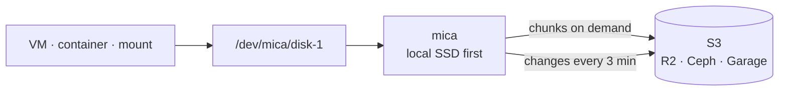

# mica

**Block devices that live in S3.**

mica gives every node a normal Linux disk, `/dev/mica/<disk>`, whose data lives in an S3 bucket. Attach a disk on any node: it is ready at once, because nothing is copied. Chunks come from S3 when they are read, and writes go to the local SSD first. Detach, and the disk can start on any other node.



## Use cases

- **Sandboxes that move.** Stop an idle sandbox on one node and start it on another. The disk follows, and the new node downloads only what the sandbox reads.
- **Labs that boot fast.** Build an image once, snapshot it, and create a disk per user in a second, with no data copied. A read profile prefetches what the boot needs.
- **Volumes for hosts and containers.** Mount a disk at a path, bind it into a container, and move it to another node later with the same data.

## Features

- **Local-SSD speed.** Writes and flushes never wait for S3. Warm I/O runs at NVMe speed.
- **Thin and deduplicated.** Disks use space only where they are written. Equal chunks are stored once, so images and their copies share data.
- **About 5 minutes of data loss at most** if a node is lost for good, while uploads keep up. None after a clean detach.
- **Snapshots and copies for free.** A snapshot is a pointer; a disk made from it copies nothing.
- **Restart without downtime.** Upgrading or restarting mica pauses I/O for about a second.
- **Safe on any S3.** No conditional writes needed, so R2, Ceph and Garage all work.
- **Fits into systemd.** Mounts come back after a reboot, and are uploaded before shutdown.

## Quick start

You need Linux 6.0 or later, systemd, an S3 bucket, and Rust with libclang (`clang-devel` on Fedora, `libclang-dev` on Debian and Ubuntu).

```bash
cargo install --git https://github.com/tanmoysrt/mica
sudo ~/.cargo/bin/mica service setup            # asks for the bucket, installs the service

mica disk create data-1 --size 20G
mica disk mount data-1 /mnt/data-1              # formats it on first use
echo hello > /mnt/data-1/hello.txt
mica disk unmount data-1                        # uploads the changes, releases the disk
```

On another node, `mica disk mount data-1 /mnt/data-1` shows the same files.

## Commands

```text
mica status                          what is attached on this node
mica disk      ls | create | attach | mount | unmount | detach | resize | delete
mica snapshot  ls | create | delete
mica gc                              free data that nothing needs
mica cache     status | prune
mica service   setup | start | stop | restart | status | logs | …
```

## How it works

1. A disk is a list of 4 MiB chunks. In S3, a chunk's key is the SHA-256 of its content.
2. A **manifest** lists every chunk of a disk. A small **head** object points to the current manifest.
3. Reads come from the local SSD, the local cache, or S3, in that order.
4. Writes go into local chunk files. A flush syncs them to the SSD.
5. Every 3 minutes, a **checkpoint** uploads the changed chunks, writes a new manifest, and moves the head.
6. An **attached** marker in S3 says which node owns a disk, so two nodes never write one disk.

## Documentation

| Page | What is in it |
|---|---|
| [Architecture](docs/architecture.md) | The parts, and how data flows, with diagrams |
| [Reliability](docs/reliability.md) | The guarantees, and what happens in each failure |
| [Design](docs/design.md) | Formats, rules and the reasons for them |
| [CLI](docs/cli.md) | Every command, with examples |
| [Operations](docs/operations.md) | Setup, configuration, permissions, cost and troubleshooting |
| [Code map](src/code-map.md) | Where each part of the code is |

## Status

mica is new. It works end to end on real devices and on Cloudflare R2, including moving disks between nodes, crash recovery and restarts without downtime. It has no automated tests yet. Try it on data you can lose.

## License

MIT. See [LICENSE](LICENSE).
