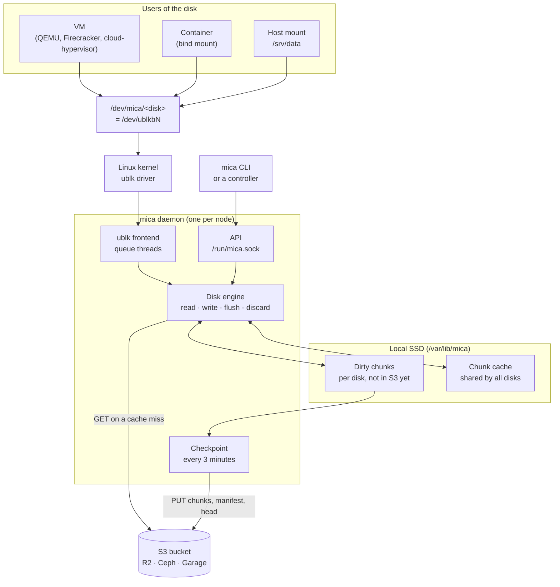
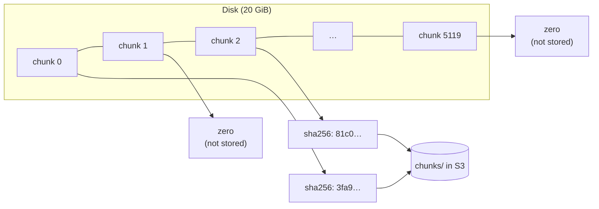
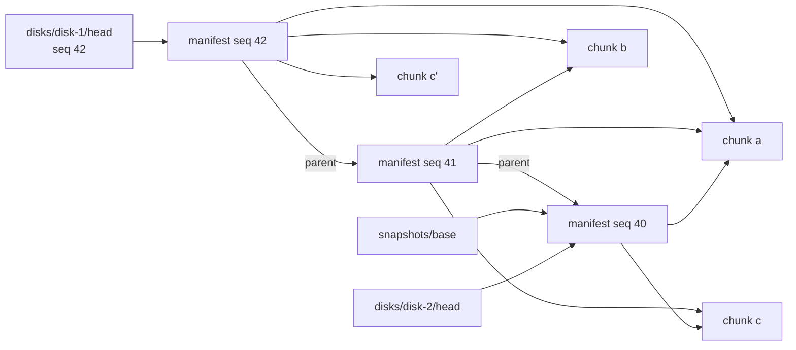
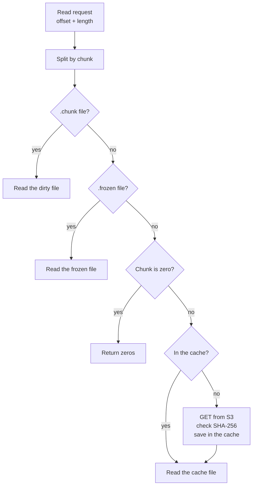
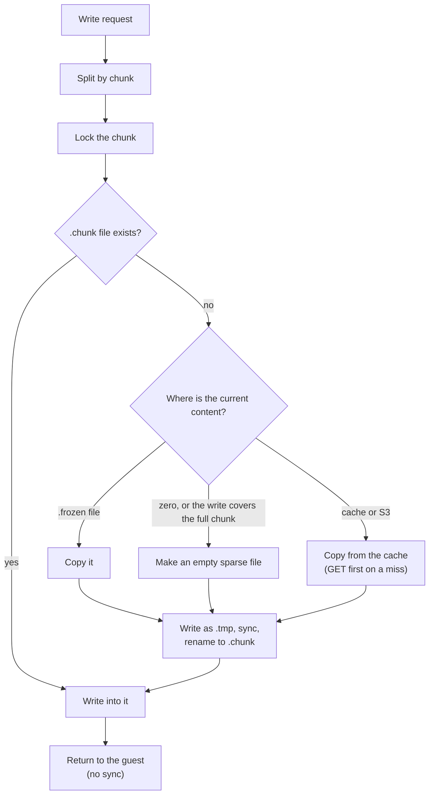
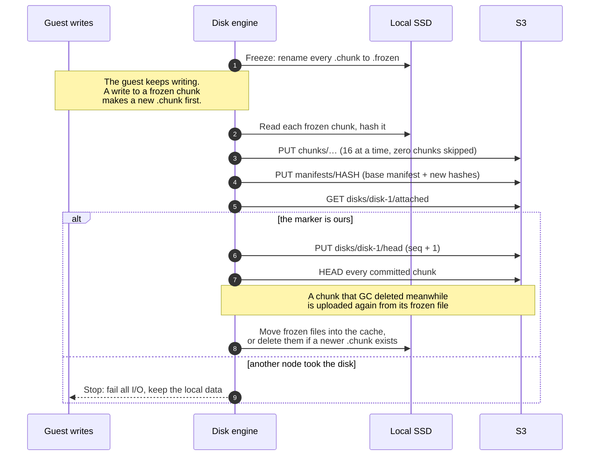
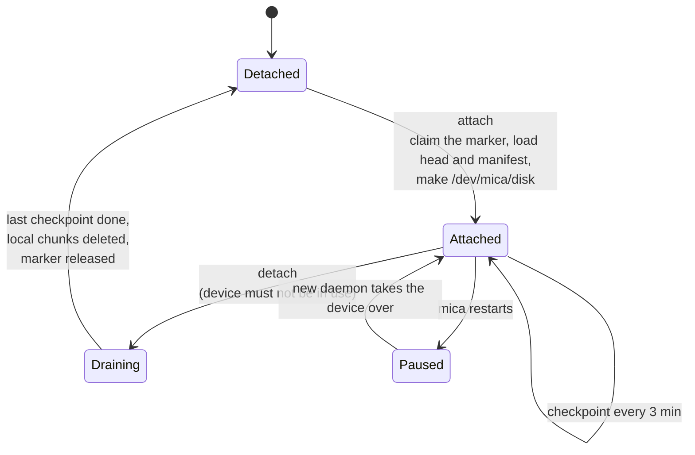
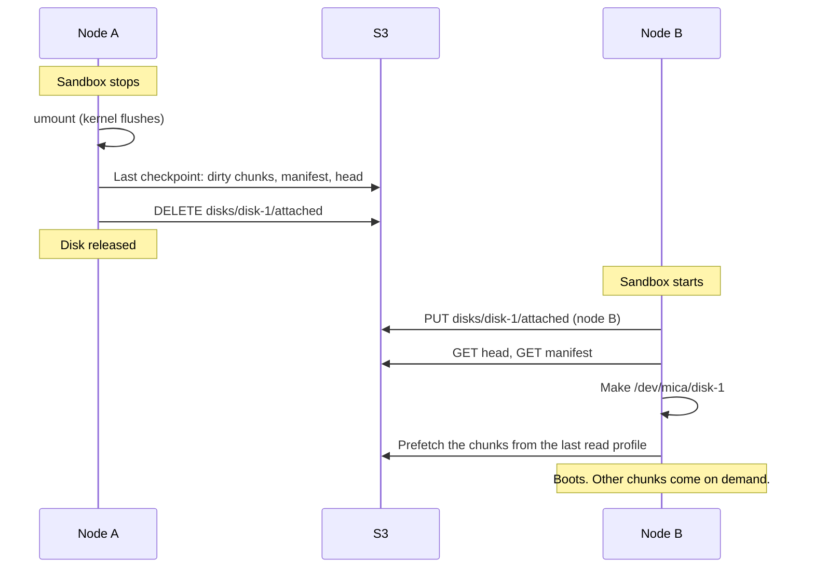
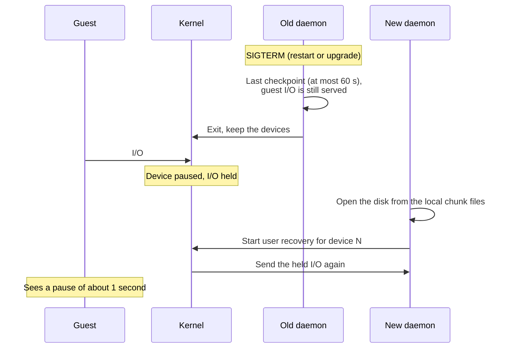
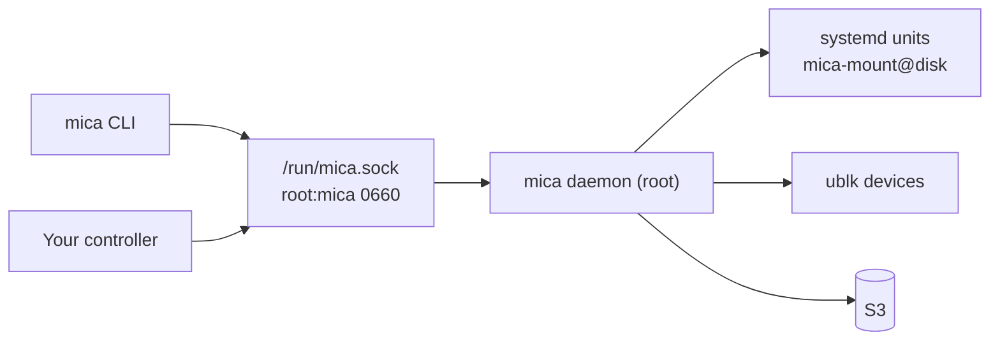

# Architecture

This page explains how mica works, from a write in a guest to an object in S3. For the reasons behind each choice, see [design.md](design.md). For what happens when something fails, see [reliability.md](reliability.md).

## The big picture

mica turns an S3 bucket into block devices. A node attaches a disk and gets `/dev/mica/<disk>`. A VM, a container or the host uses it like any other disk.



Three rules shape everything else:

1. **Writes go to the local SSD first.** The guest never waits for S3 on a write or a flush.
2. **Reads fetch from S3 only on a miss.** Nothing is copied when a disk attaches.
3. **A background checkpoint uploads changes** every 3 minutes. After a detach, S3 has everything, and the disk can attach on any other node.

## Chunks

mica splits every disk into **chunks** of 4 MiB. A 100 GiB disk has 25,600 chunks.

In S3, a chunk is an immutable object. Its key is the SHA-256 of its content. Thus:

- Two equal chunks are one object. An image and all the disks made from it share their chunks.
- mica checks every downloaded chunk against its key. A corrupt chunk is rejected.
- An all-zero chunk is never stored.



A disk is **thin**. `create` stores no chunks. A chunk uses space only after the guest writes to it, wherever the write lands.

## What is in S3

```text
chunks/<first 2 hex>/<chunk hash>   4 MiB of data, immutable
manifests/<manifest hash>           the chunk list of one disk at one moment, immutable
disks/<disk>/head                   which manifest is current, overwritten on each commit
disks/<disk>/attached               which node owns the disk, only while attached
snapshots/<name>                    a named manifest
gc/lock                             only while a GC runs
```



- **A manifest** lists every chunk of a disk: 32 bytes per chunk, so 800 KiB for 100 GiB. It is a full list, not a change list, so one manifest describes the full disk.
- **The head** points to the current manifest, and holds the read profile (see [Fast boot](#fast-boot)).
- **A snapshot** is a pointer to a manifest. It copies no data.
- **A disk made from a snapshot** starts with a head that points to the snapshot's manifest. It shares every chunk until it writes.

## What is on the local SSD

```text
/var/lib/mica/
  node-id                      random ID of this node
  cache/<xx>/<chunk hash>      clean chunks; S3 has all of them
  disks/<disk>/
    state                      attached or orphaned, and the ublk device number
    dirty/<index>.chunk        a chunk the guest changed
    dirty/<index>.frozen       a chunk that a checkpoint uploads now
    dirty/<index>.tmp          a chunk being made; deleted after a crash
```

**Dirty chunks** are the only local data that S3 does not have. mica never deletes one before a commit includes it.

**The cache** holds clean chunks. Any of them can go, because S3 has them all. The cache evicts the least recently used chunks at its limit (50 GiB by default), and `mica cache prune` removes chunks that no attached disk uses.

## The read path



When many requests miss the same chunk, mica sends one GET.

## The write path



- The copy uses `copy_file_range`. On XFS and btrfs this is a reflink and costs no I/O.
- The `.tmp` step means that a crash never leaves a half-copied chunk that looks complete.
- The chunk lock is held until the data is in the file. Thus a checkpoint cannot freeze a chunk while a write goes into it.

## Flush

The device tells the kernel that it has a volatile write cache. So filesystems send FLUSH when they need durability (`fsync`, journal commits, `umount`).

On FLUSH, mica syncs every changed `.chunk` file and the dirty folder, then returns. **A flush never touches S3.** When a flush returns, the data survives a crash of mica or a reboot of the node.

## Discard

- A discard of a **whole chunk** turns it into zeros. The checkpoint then stores it as a zero chunk: nothing to upload, nothing to store.
- A discard of **part of a chunk** is ignored. A discard is only a hint, and honoring it would download and upload the chunk again.
- The device reports a discard granularity of one chunk, so trims arrive as whole chunks.
- `mica disk unmount` runs `fstrim` before it unmounts. So space that deleted files freed is never uploaded.

## Checkpoint

A checkpoint moves dirty chunks to S3 and commits a new manifest. It runs every 3 minutes while a disk has dirty chunks, earlier when local space runs low, and at detach and snapshot. An idle disk makes no S3 requests.



A chunk that the guest writes many times, such as the filesystem journal, goes up at most once per checkpoint.

## Attach and detach



**Attach**

1. Claim the `attached` marker: write it with a random claim ID, wait 1 s, read it back. If another node holds it, or claimed at the same moment, stop. `--force` takes it, and is only for a node that is down.
2. Read the head, then the manifest.
3. Add any local chunks left by a crash.
4. Make the ublk device and the link `/dev/mica/<disk>`.
5. Start the checkpoint loop, the prefetch, and a watcher that reads the marker every minute.

**Detach** always waits. When it returns, S3 has all the data and the disk is free.

1. Refuse if the device is open or mounted.
2. Remove the device.
3. Run checkpoints until one succeeds.
4. Delete the local chunks, then the marker, then the disk folder.

## Moving a disk between nodes

This is the main use of mica: a sandbox stops on one node and starts on another.



Node B copies nothing up front. A 100 GiB disk attaches with two GETs, and only the chunks the sandbox reads are downloaded.

## Fast boot

A cold boot reads chunks from all over the disk. One GET at a time, that is slow. So mica records a **read profile**: the first 512 chunks the guest reads in a session, in order. Each checkpoint saves it in the head.

At the next attach, mica fetches those chunks, 32 at a time, before the guest asks for them. For an image, the profile comes from its first boot. For a sandbox, it comes from the last session, so the user's working set is ready first. Prefetch reads are never recorded, so the profile keeps up with the guest.

## Daemon restart without downtime

Devices use **ublk user recovery**. When the daemon exits, the kernel keeps `/dev/ublkbN` and holds its I/O instead of failing it.



No acknowledged write is lost: every one is in a local chunk file. `mica service restart`, an upgrade, and a crash of the daemon all work this way.

## Snapshots and GC

A snapshot records the current manifest of a disk under a name. A new disk can start from it, and shares its chunks.

Chunks that nothing needs any more stay in S3 until someone runs `mica gc`. GC keeps every disk's current manifest and its last 5 checkpoints, and every snapshot. It deletes other chunks and manifests that are older than 24 hours. [reliability.md](reliability.md#garbage-collection) explains why this is safe while disks are in use.

## Control plane

Every node runs one daemon, `mica.service`. The CLI and any controller talk to it on `/run/mica.sock`, one JSON line per request. Root and members of the `mica` group can use the socket.



`mica disk mount` goes through the daemon, which starts a `mica-mount@<disk>` unit. The unit attaches and mounts at boot, and unmounts and uploads before shutdown.

## Where the code is

[src/code-map.md](../src/code-map.md) lists every source file and the order to read them.
