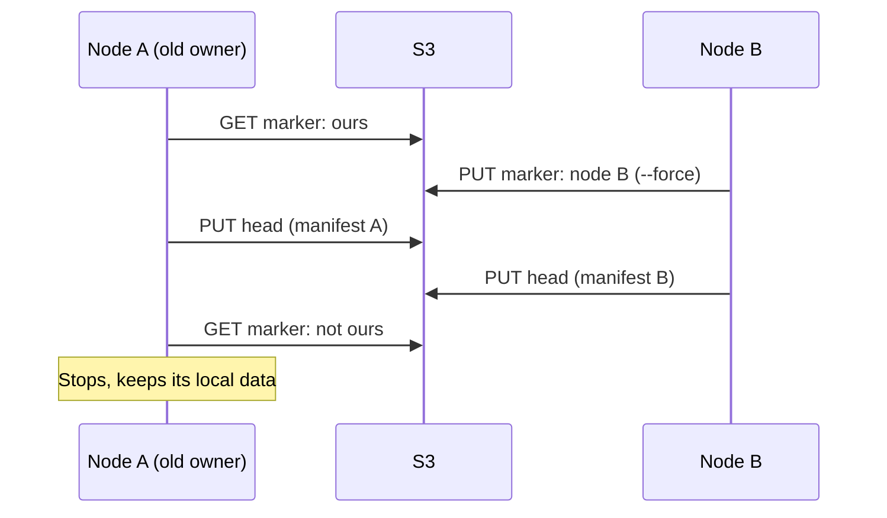

# Reliability

This page states what mica guarantees, what happens in each kind of failure, and why the design keeps data safe. It assumes you know the parts from [architecture.md](architecture.md).

## Guarantees

1. **Flushed data survives a crash of mica or a reboot of the node.** When a guest FLUSH (`fsync`) returns, the data is on the local SSD.
2. **Data older than 5 minutes is in S3, while S3 is reachable.** It survives the loss of the node. If uploads fall behind, mica shows the disk as **behind**.
3. **After a detach, S3 has all the data.** Nothing is lost when a sandbox moves to another node.
4. **mica never deletes local data that S3 does not have.** Only a commit that includes a chunk frees its local copy.
5. **Only one node writes a disk at a time.** The controller makes sure of this, and mica checks it at every commit.
6. **mica never serves corrupt data from S3.** Every downloaded chunk and manifest is checked against its SHA-256.

## What happens when something fails

| Failure | What mica does | Data lost |
|---|---|---|
| The guest crashes | Nothing. Flushed data is on the SSD. | Writes the guest did not flush, as with any disk |
| The mica daemon restarts or crashes | The kernel holds the device's I/O. The new daemon takes the device over from the local files. | None |
| The node reboots or loses power | The devices are gone. At boot, mica uploads the local chunks, then releases the disk, or keeps it for a `mica-mount@` unit. | Writes the guest did not flush |
| The node is lost for good | Another node attaches with `--force` and reads from S3. | At most the last ~5 minutes |
| S3 is down or slow | Guests keep writing to the SSD. Checkpoints retry every 10 s. After 5 minutes the disk shows **behind**. At the dirty limit, writes wait. | None, while the node lives |
| The network splits, and another node takes the disk | The old node sees the new marker at its next checkpoint. It stops all I/O and keeps its local data as **orphaned**. | The old node's last unsaved writes, kept on its SSD for an operator |
| A chunk in S3 is corrupt | The hash check fails, and the read fails with an I/O error. | Nothing is served silently wrong |
| The local SSD crashes during a write | Recovery at start: `.tmp` files are deleted, a `.chunk` beats a `.frozen`. | None of the flushed data |
| GC runs while disks are in use | The grace period and the upload rule protect new chunks. | None |

## Why each step is in its order

The order of the steps is what makes mica safe without locks in S3.

### A new chunk becomes local data in one step

After a crash, a `.tmp` file is deleted, and a `.chunk` file is always complete. A half-copied chunk never looks like good data.

### A commit writes objects that nothing points to, then the pointer

- Chunks and the manifest are new objects that nothing refers to yet. If mica dies here, the old head still describes a full, consistent disk.
- One PUT of the head switches from one full disk to the next. S3 replaces an object atomically, so a reader sees the old manifest or the new one, never a mix.
- Local copies are freed only after the head is in S3.

### Detach deletes local data before it releases the disk

After a crash, mica finds one of two states:

- **A folder with chunks, and our marker:** the upload was not done. mica uploads it now.
- **A folder without chunks:** S3 has everything. mica releases the marker and deletes the folder.

Chunks without our marker are never uploaded: another node may own the disk now.

### A checkpoint checks ownership just before it commits

The `attached` marker says which node owns a disk. A checkpoint reads it just before the head PUT. If the marker is not ours, the node stops at once:

- It fails all I/O on the device, so the guest sees errors instead of writes that go nowhere.
- It keeps its local chunks and marks the disk **orphaned**. An operator decides what to do with them.

## Fencing without conditional writes

Garage ignores `If-Match` and `If-None-Match`, and Ceph support depends on the version. So mica does not rely on them. Instead:

1. **The controller** makes sure that one node owns a disk. mica is not a cluster manager.
2. **The marker** catches mistakes: a missing detach, or a second attach by a script.
3. **Full manifests** make the one remaining race harmless.

That race: node A passes its marker check, then node B takes the disk with `--force`, then node A writes the head one more time.

For a short time the head may point to node A's manifest. It is still a full disk, never a mix of two. The rule that prevents even this: **use `--force` only when the old node is powered off or fenced.**

## Integrity

- A chunk's key is the SHA-256 of its content. mica checks it after every download.
- A manifest's key is the SHA-256 of the file. mica checks it after every download.
- Cache files are written as `.tmp`, synced, then renamed, so a crash cannot leave a torn cache file under a good name.

## Daemon restart

A restart pauses I/O for about one second, and loses nothing:

1. On SIGTERM, the daemon runs one last checkpoint for each disk (at most 60 s). The guest's I/O is still served during this time.
2. The daemon exits and keeps its devices. The kernel holds new I/O.
3. The new daemon opens each disk from the same local files. Every write mica acknowledged is in those files.
4. It takes each device over. The kernel sends the held and in-flight requests again.

If no daemon comes back, I/O waits for ever. So `mica.service` uses `Restart=always`, and `mica service stop` refuses while disks are attached.

If a device's disk now belongs to another node, the new daemon deletes the device. Its users get I/O errors instead of waiting for ever.

## Garbage collection

GC deletes chunks and manifests that no disk, snapshot or kept checkpoint needs. It must never delete a chunk that a disk is about to commit.

**The danger.** A checkpoint uploads chunks first and writes the head last. GC can read the head in between. The new chunks then look unused.

**The protections:**

1. **Grace period.** GC deletes only objects older than 24 hours. A checkpoint takes minutes, so its new chunks are always young.
2. **The upload rule.** A checkpoint skips the upload of a chunk only when the disk's current manifest already has it. It uploads any other chunk again, even if S3 may have it. That chunk could be garbage that GC is about to delete; the new upload makes it young again.
3. **A second look.** Just before each delete, GC reads the object's age again.
4. **Stop on doubt.** If GC cannot read a head, a snapshot or a kept manifest, it deletes nothing.
5. **Create from a snapshot** checks that the snapshot still exists after it writes the new head. If the snapshot was deleted meanwhile, the create fails and undoes itself.

**One GC at a time.** The daemon runs one GC at a time. Across nodes, GC writes `gc/lock`. Without conditional writes this lock is not atomic, but two GCs at once are still safe: each deletes only garbage. The lock only stops needless work.

**Short grace periods** (`mica gc --grace 10m`) are for tests. Below 1 hour, GC refuses to run while any disk is attached anywhere.

## Local space

- The dirty chunks of a disk have a limit (20 GiB by default). At half of it, a checkpoint starts early. At the limit, new writes wait until a checkpoint frees space. The guest sees a slow disk, not an I/O error.
- The cache has a limit (50 GiB by default). At the limit, it deletes the least recently used chunks. Any cache chunk can go, because S3 has it.

## What is not protected

- **Loss of the node's SSD and of S3 at the same time.** S3 is the durable copy.
- **Writes the guest never flushed** before a crash. This is normal disk behavior.
- **The last few minutes after a node is lost for good.** Checkpoints run every 3 minutes, so at most about 5 minutes are lost.
- **Deleting a disk or snapshot by mistake.** Delete removes the pointer. The data stays in S3 until GC runs, so an operator can recover it by hand before then.
